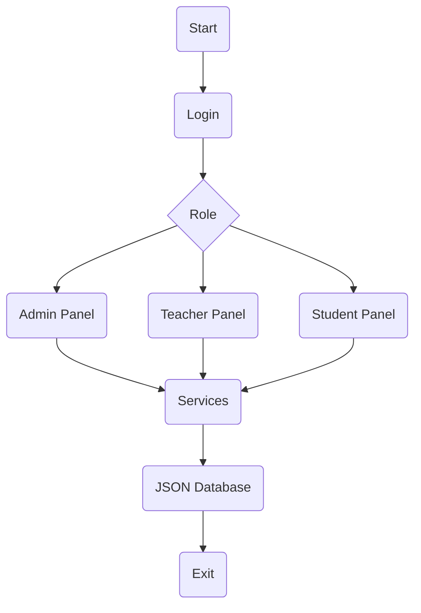

<h1 align="center">
🎓 Education Center Management System (CLI)
</h1>

<p align="center">

A modern, scalable and object-oriented Education Center Management System built with Python.

</p>

---

<p align="center">


<br>


</p>

---

<p align="center">


</p>

---

# 📖 About

Education Center Management System is a **Command Line Interface (CLI)** application developed in **Python** to simulate the management of a real education center.

The project follows **Object-Oriented Programming (OOP)** principles and uses **JSON files as a lightweight local database**. It is designed as a portfolio project to practice clean architecture, modular programming, CRUD operations, inheritance, validation, and file management.

> **Goal:** Build a maintainable, extensible and professional CLI application that can later be migrated to **SQLite**, **PostgreSQL**, or **Django** without major architectural changes.

---

# ✨ Features

| Module | Description | Status |
|----------|------------|:------:|
| 🔐 Authentication | Login & Logout | ✅ |
| 👤 User Management | Base User Model | ✅ |
| 👨‍🎓 Student Management | Full CRUD | ✅ |
| 👨‍🏫 Teacher Management | Full CRUD | ✅ |
| 📚 Course Management | Full CRUD | ✅ |
| 👥 Group Management | CRUD & Student Assignment | 🚧 |
| 💳 Payment Management | Payment Tracking | 🚧 |
| 📅 Attendance Management | Attendance Records | 🚧 |
| 🔍 Search System | Search by ID & Username | ✅ |
| 📝 Validation | Input Validation | ✅ |
| 💾 JSON Database | Persistent Storage | ✅ |

---

# 🛠 Built With

| Technology | Purpose |
|------------|---------|
| Python | Programming Language |
| JSON | Local Database |
| datetime | Date & Time |
| calendar | Date Validation |
| UUID / Custom ID | Unique Identifiers |
| OOP | Project Architecture |

---

# 📂 Project Structure

```text
education-center-management-cli/
│
├── data/
│   ├── attendance.json
│   ├── courses.json
│   ├── groups.json
│   ├── ids.json
│   ├── payments.json
│   ├── students.json
│   ├── teachers.json
│   └── users.json
│
├── database/
│   └── json_service.py
│
├── menu/
│   ├── menu_admin.py
│   ├── menu_student.py
│   ├── menu_teacher.py
│   └── menu.py
|
├── models/
│   ├── admin.py
│   ├── attendance.py
│   ├── course.py
│   ├── group.py
│   ├── payment.py
│   ├── student.py
│   ├── teacher.py
│   └── user.py
│
├── panel/
│   ├── panel_admin.py
│   ├── panel_student.py
│   └── panel_teacher.py
|
├── services/
│   ├── attendance_service.py
│   ├── auth_service.py
│   ├── course_service.py
│   ├── group_service.py
│   ├── payment_service.py
|   ├── teacher_service.py
│   ├── student_service.py
│   └── user_service.py
│
├── utils/
│   ├── generator.py
│   └── validator.py
│
├── config.py
├── main.py
└── README.md
```

---

## 🚀 Quick Start

```bash
# Clone the repository
git clone https://github.com/javlonbeksaidov-developer/education-center-managent-cli.git

# Navigate to the project
cd education-center-managent-cli

# Run the application
python main.py
```

---

# 🔄 Application Flow



---

# ⭐ Support

If you found this project useful, please consider giving it a ⭐ on GitHub.

It helps others discover the project and motivates future improvements.

<p align="center">

<a href="https://github.com/javlonbeksaidov-developer/education-center-managent-cli">

</a>

</p>

---

# ❤️ Thanks for Visiting

<p align="center">

**Happy Coding! 🚀**

</p>

<!-- ========================================================== -->
<!--                        FOOTER                              -->
<!-- ========================================================== -->

<p align="center">

Made with ❤️ using Python by **Javlonbek Saidov**

</p>