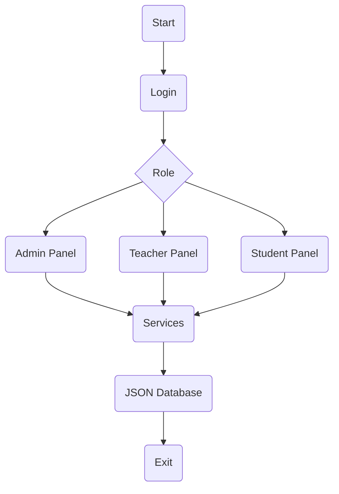

<h1 align="center">
🎓 Education Center Management System (CLI)
</h1>

<p align="center">

A modern, scalable and object-oriented Education Center Management System built with Python.

</p>

---

<p align="center">


<br>


</p>

---

<p align="center">


</p>

---

# 📖 About

Education Center Management System is a **Command Line Interface (CLI)** application developed in **Python** to simulate the management of a real education center.

The project follows **Object-Oriented Programming (OOP)** principles and uses **JSON files as a lightweight local database**. It is designed as a portfolio project to practice clean architecture, modular programming, CRUD operations, inheritance, validation, and file management.

> **Goal:** Build a maintainable, extensible and professional CLI application that can later be migrated to **SQLite**, **PostgreSQL**, or **Django** without major architectural changes.

---

# 🛠️ Built With

| Technology | Description |
|------------|-------------|
| 🐍 **Python 3.13** | Main programming language |
| 🏗️ **Object-Oriented Programming (OOP)** | Project architecture and code organization |
| 💾 **JSON** | Local data storage |
| 📅 **datetime** | Date and time management |
| 📆 **calendar** | Date validation |
| 🆔 **uuid** | Unique ID generation |
| 🖥️ **CLI** | Command Line Interface |
| 🧩 **Clean Architecture** | Modular project structure |
| 🔄 **CRUD** | Data management operations |
| 🌿 **Git** | Version control |
| 🐙 **GitHub** | Source code hosting |

---

# 📂 Project Structure

```text
education-center-management-cli/
│
├── data/
│   ├── attendance.json
│   ├── courses.json
│   ├── groups.json
│   ├── ids.json
│   ├── payments.json
│   ├── students.json
│   ├── teachers.json
│   └── users.json
│
├── database/
│   └── json_service.py
│
├── menu/
│   ├── menu_admin.py
│   ├── menu_student.py
│   ├── menu_teacher.py
│   └── menu.py
|
├── models/
│   ├── admin.py
│   ├── attendance.py
│   ├── course.py
│   ├── group.py
│   ├── payment.py
│   ├── student.py
│   ├── teacher.py
│   └── user.py
│
├── panel/
│   ├── panel_admin.py
│   ├── panel_student.py
│   └── panel_teacher.py
|
├── services/
│   ├── attendance_service.py
│   ├── auth_service.py
│   ├── course_service.py
│   ├── group_service.py
│   ├── payment_service.py
|   ├── teacher_service.py
│   ├── student_service.py
│   └── user_service.py
│
├── utils/
│   ├── generator.py
│   └── validator.py
│
├── config.py
├── main.py
└── README.md
```

---

# 🖥️ Application Menus

## 🚀 Start Menu

```text
┌─────────────────────────────────────┐
│     EDUCATION CENTER MANAGEMENT     │
├─────────────────────────────────────┤
│ 1. Login                            │
│ 0. Exit                             │
└─────────────────────────────────────┘
```

---

## 👑 Admin Panel

```text
┌─────────────────────────────────────┐
│             ADMIN PANEL             │
├─────────────────────────────────────┤
│ 1. Profile                          │
│ 2. Students                         │
│ 3. Teachers                         │
│ 4. Courses                          │
│ 5. Groups                           │
│ 6. Payments                         │
│ 7. Attendance                       │
│ 8. Reports                          │
│ 0. Exit                             │
└─────────────────────────────────────┘
```

---

## 👨‍🎓 Student Management

```text
┌─────────────────────────────────────┐
│          STUDENT MANAGEMENT         │
├─────────────────────────────────────┤
│ 1. Add Student                      │
│ 2. Show Students                    │
│ 3. Search Student                   │
│ 4. Update Student                   │
│ 5. Delete Student                   │
│ 6. Block / Activate                 │
│ 0. Back                             │
└─────────────────────────────────────┘
```

---

## 👨‍🏫 Teacher Management

```text
┌─────────────────────────────────────┐
│          TEACHER MANAGEMENT         │
├─────────────────────────────────────┤
│ 1. Add Teacher                      │
│ 2. Show Teachers                    │
│ 3. Search Teacher                   │
│ 4. Update Teacher                   │
│ 5. Delete Teacher                   │
│ 6. Block / Activate                 │
│ 0. Back                             │
└─────────────────────────────────────┘
```

---

## 📚 Course Management

```text
┌─────────────────────────────────────┐
│          COURSE MANAGEMENT          │
├─────────────────────────────────────┤
│ 1. Add Course                       │
│ 2. Show Courses                     │
│ 3. Update Course                    │
│ 4. Delete Course                    │
│ 5. Pause Course                     │
│ 0. Back                             │
└─────────────────────────────────────┘
```

---

## 👥 Group Management

```text
┌─────────────────────────────────────┐
│          GROUP MANAGEMENT           │
├─────────────────────────────────────┤
│ 1. Create Group                     │
│ 2. Show Groups                      │
│ 3. Add Student                      │
│ 4. Remove Student                   │
│ 5. Update Group                     │
│ 6. Delete Group                     │
│ 7. Pause Group                      │
│ 0. Back                             │
└─────────────────────────────────────┘
```

---

## 💳 Payment Management

```text
┌─────────────────────────────────────┐
│         PAYMENT MANAGEMENT          │
├─────────────────────────────────────┤
│ 1. Add Payment                      │
│ 2. Payment History                  │
│ 3. Monthly Payments                 │
│ 4. Unpaid Students                  │
│ 5. Delete Payment                   │
│ 0. Back                             │
└─────────────────────────────────────┘
```

---

## 📅 Attendance Management

```text
┌─────────────────────────────────────┐
│       ATTENDANCE MANAGEMENT         │
├─────────────────────────────────────┤
│ 1. Take Attendance                  │
│ 2. Show Attendance                  │
│ 3. Today's Attendance               │
│ 4. Student Attendance               │
│ 0. Back                             │
└─────────────────────────────────────┘
```

---

## 📊 Reports

```text
┌─────────────────────────────────────┐
│               REPORTS               │
├─────────────────────────────────────┤
│ 1. Total Students                   │
│ 2. Total Teachers                   │
│ 3. Total Groups                     │
│ 4. Total Courses                    │
│ 5. Monthly Income                   │
│ 6. Top Groups                       │
│ 7. Attendance Report                │
│ 8. Export Report                    │
│ 0. Back                             │
└─────────────────────────────────────┘
```

---

## 👨‍🏫 Teacher Panel

```text
┌─────────────────────────────────────┐
│            TEACHER PANEL            │
├─────────────────────────────────────┤
│ 1. My Profile                       │
│ 2. My Groups                        │
│ 3. Students                         │
│ 4. Attendance                       │
│ 0. Exit                             │
└─────────────────────────────────────┘
```

---

## 👨‍🎓 Student Panel

```text
┌─────────────────────────────────────┐
│            STUDENT PANEL            │
├─────────────────────────────────────┤
│ 1. My Profile                       │
│ 2. My Group                         │
│ 3. Attendance                       │
│ 4. Payments                         │
│ 0. Exit                             │
└─────────────────────────────────────┘
```

---

## 🚀 Quick Start

```bash
# Clone the repository
git clone https://github.com/javlonbeksaidov-developer/education-center-managent-cli.git

# Navigate to the project
cd education-center-managent-cli

# Run the application
python main.py
```

---

# 🔄 Application Flow



---

# ❤️ Thanks for Visiting

<p align="center">

**Happy Coding! 🚀**

</p>

<p align="center">

Made with ❤️ using Python by **Javlonbek Saidov**

</p>